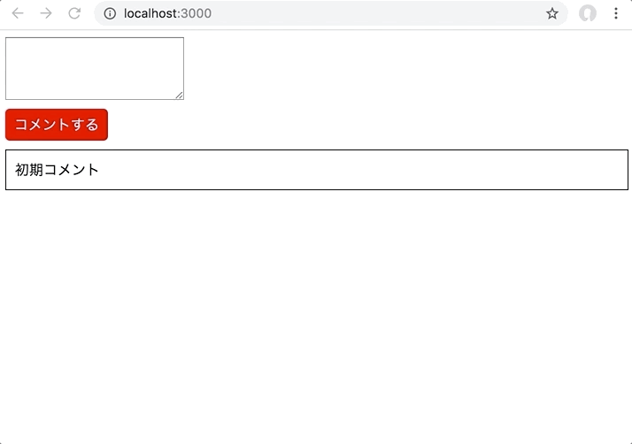

# レポジトリ内容

この課題は、Web白熱教室のReact課題その6「[【エクササイズ】Reactで簡易掲示板を作る](https://tsuyopon.xyz/learning-contents/web-dev/javascript/react/js-exercise-for-react-6/)」の課題レポジトリになります。

## 課題

- 以下の完成形の画像と同じ見た目になるように実装する
- 具体的な実装の流れは、以下の「課題をクリアするためのステップ」の内容を参考にすること

## 完成形

### 課題をクリアするためのステップ(実装のヒント)

- [ ] `components` ディレクトリを作成して、次の内容でディレクトリとファイルを作成する
    - `Button`ディレクトリ
        - Button.css
        - Button.jsx
    - `CommentList`ディレクトリ
        - CommentList.css
        - CommentList.jsx
    - `Form`ディレクトリ
        - Form.css
        - Form.jsx
- [ ] Buttonコンポーネントの実装内容は次の通り
    - Button.css
        - Buttonのスタイルを定義する
        - `Button.jsx` からのみ使う
    - Button.jsx
        - propsに `onClickHandler` という関数を受け取れる
        - `props.onClickHandler` はボタンをクリックしたら実行する
- [ ] CommentListコンポーネントの実装内容は次の通り
    - CommentList.css
        - CommentListのスタイルを定義する
        - `CommentList.jsx` からのみ使う
    - CommentList.jsx
        - propsに `comments` という配列を受け取れる
        - `props.comments` 配列には文字列のみが格納される
        - `props.comments` 配列をループして、コメント一覧を表示する
- [ ] Formコンポーネントの実装内容は次の通り
    - Form.css
        - Formのスタイルを定義する
        - `Form.jsx` からのみ使われる
    - Form.jsx
        - 入力フォームには `textarea` を使う
        - フォームに入力した内容は `state` の `body` プロパティに保持する
        - propsに `onSubmit` という関数を受け取れる
        - `handleChange` メソッドと`sendBodyToParent`メソッドを持ち、それぞれ次の機能を実装する
            - `handleChange` メソッド
                - `textarea` のonChangeのコールバックとしてセットするメソッド
                - setStateを使って `state.body` の値を更新する
            - `sendBodyToParent`
                - ボタンを押したときに実行するメソッド
                - `state.body` に含まれている無駄なスペースを `trim` メソッドを使って取り除く
                    - ドキュメント: [String.prototype.trim()](https://developer.mozilla.org/ja/docs/Web/JavaScript/Reference/Global_Objects/String/trim)
                - `trim` した結果の `state.body` が空文字列だった場合、「何も入力されていません」というアラートメッセージを表示して、処理を中断する
                - `trim` した結果の `state.body` が1文字以上の文字列だった場合は、その文字列を引数にセットして `props.onSubmit` メソッドを実行する
                - setStateメソッドを使って `state.body` に空文字列をセットする
- [ ] Formコンポーネントの実装内容は次の通り
    - stateに `comments` というプロパティ名で配列を保持する
    - `state.comments` 配列は初期値として「初期コメント」という文字列を1つ格納する
    - `addComment`メソッドを持ち、次の機能を実装する
        - Formのpropsである `onSubmit` の値としてaddCommentメソッドをセットする
        - `addComment` メソッドはFormの入力内容を引数経由で受け取る
        - 引数経由で受け取ったFormの入力内容を `state.comments` に追加する
            - **注意点**
                - this.state.comments.push(comment)ではダメ
                - stateの更新は常に `setState` メソッドを使う
    - renderメソッドでは `Form` コンポーネントと `Comment` コンポーネントをセットするｖ
- [ ] `npm start` を実行して、上に貼った「完成形」と同じ見ための表示がされれば完了

## レビュー依頼時の注意

- このプルリクをフォークして作業を開始しても構わないし、自分で `create-react-app` を使ってゼロから環境を作りあげるでも良い。
    - このプルリクをフォークして作業を開始して、最終的にレビューを依頼するときは以下の動画を参考にすること
        - [【動画解説】学習コンテンツの課題に取り組むときの注意点](https://tsuyopon.xyz/learning-contents/github/when-you-try-the-excercise-of-learning-contents/)
    - 自分で `create-react-app` を使ってゼロから環境を作ったものをレビューに投げる時は以下の動画を参考にしてプルリクを作成すること
        - [【動画解説】GitHubにレポジトリをPushするまでの流れ](https://tsuyopon.xyz/learning-contents/github/how-to-push-a-local-repository-to-the-github/)
        - [【動画解説】GitHubでプルリクエストを作るまでの流れ](https://tsuyopon.xyz/learning-contents/github/how-to-create-a-pull-request-on-github/)
- 一般的な開発フローに慣れるために、[git flow](https://qiita.com/KosukeSone/items/514dd24828b485c69a05)で作業を進めることをオススメする
    - masterブランチからdevelopブランチを作成する
    - developブランチからfeatureブランチを作成する
    - featureブランチで作業をして、プルリクエストを作成するときは、developブランチにマージされるように作成する

## 参考記事

課題をこなしていて、行き詰まったら以下の資料を参考にしていただければ解答にたどり着けるかと思います。

- Web白熱教室
    - [【React】コンポーネントのstateの使い方を理解する](https://tsuyopon.xyz/learning-contents/web-dev/javascript/react/understand-and-how-to-use-the-state/)
    - [【React】コンポーネントのライフサイクルを理解する【ライフサイクル図付き】](https://tsuyopon.xyz/learning-contents/web-dev/javascript/react/understand-the-lifecycle-of-components/)
    - [【React】コンポーネントにクリックイベントを実装する](https://tsuyopon.xyz/learning-contents/web-dev/javascript/react/how-to-handle-click-events/)
    - [【React】配列のmapメソッドを活用してリストを作成する方法](https://tsuyopon.xyz/learning-contents/web-dev/javascript/react/lists-and-keys/)
    - [【React】入力フォームを作成する](https://tsuyopon.xyz/learning-contents/web-dev/javascript/react/forms/)
    - [【React】子コンポーネントから親コンポーネントの関数を実行する](https://tsuyopon.xyz/learning-contents/web-dev/javascript/react/call-parent-functions-from-a-child-component/)
- プルリクエスト(`git flow` の開発スタイルで機能毎にブランチを分けて実装を進める際に参考になるページ)
    - https://github.com/tsuyopon-xyz/api_server_with_mock_db/pulls?q=is%3Apr+is%3Aclosed
